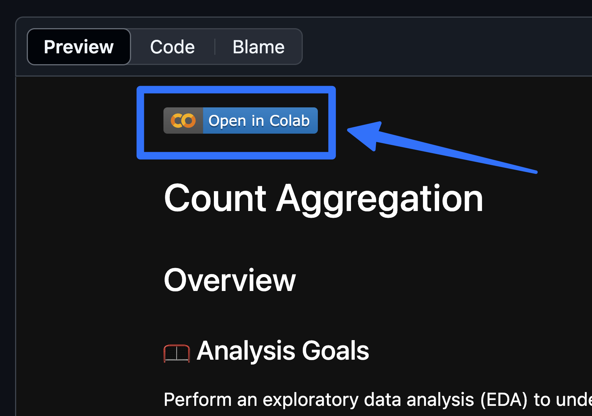

# 📊 Intermediate SQL for Data Analytics - Full Course

Data Nerds! This repo contains all the files needed to follow along my free course: [Intermediate SQL for Data Analytics]()

## Team Members 👥
**🙋🏼‍♂️ Course Leader:** [Luke Barousse](https://www.linkedin.com/in/luke-b)  
**🎬 Course Producer:** [Kelly Adams](https://www.linkedin.com/in/kellyjianadams)  
**📺 Video Editor:** [Brannon Linder](https://www.linkedin.com/in/brannonlinder)

## Table of Contents

👷👷👷 Section Under Construction 👷👷👷
> Note: Add Open in Colab button to each notebook.

1. [About the Course](0_Intro/1_About_Course.ipynb) - [Open in Colab](https://colab.research.google.com/github/lukebarousse/Int_SQL_Data_Analytics_Course/blob/main/0_Intro/1_About_Course.ipynb)

## How to Run SQL Files
### Method 1️⃣: Run in Google Colab (Recommended)
#### Prerequisites:
- Google Account

#### Steps:
1. Click the "Open in Colab" button at top of any notebook.

2. Run all cells in the notebook.
---
### Method 2️⃣: Run Database Locally w/ PGAdmin
*Note: Second half of course uses this method.*
#### Prerequisites:
- [PostgreSQL Installed](https://www.postgresql.org/download/)
- [pgAdmin Installed](https://www.pgadmin.org/download/)

#### Steps:
1. Download the [Contoso database](https://github.com/lukebarousse/Int_SQL_Data_Analytics_Course/releases).
2. Open pgAdmin 4.
3. In Object Explorer, connect to your PostgreSQL server.
4. Right-click on "Databases" > "Create" > "Database...".  


5. Enter `contoso_100k`for "Database" and click "Save".
6. In Object Explorer, right-click on the `contoso_100k` database > "PSQL Tool".
7. In the PSQL Tools Window, enter `\i [path to contoso_100k.sql]` and press enter.
> ```
> \i '/Users/lukebarousse/Desktop/contoso_100k.sql'
> ```
8. If necessary, in the Query Tool, set default password for the `postgres` user to `password`.  
 **⚠ If you have sensitive information in your server DO NOT do this step; also not required if this is already your password ⚠️**
> ```
> ALTER USER postgres WITH PASSWORD 'password';
> ```
---
### Method 3️⃣: Run SQL Locally in Jupyter Notebook (Advanced)
#### Prerequisites:
- [PostgreSQL Installed](https://www.postgresql.org/download/)
- [Anaconda Installed](https://www.anaconda.com/products/distribution)
- Database Running Locally

#### Steps:
1. Create a new conda environment with `ipykernel`, `pandas`, and `matplotlib`:
> ```
> conda create -n sql_course python=3.11 ipykernel pandas matplotlib
> ```
2. Activate the environment:
> ```
> conda activate sql_course
> ```
3. Install the `jupysql` and `psycopg2` packages:
> ```
> conda install -c conda-forge jupysql psycopg2
> ```
4. Upgrade `jupysql`, necessary due to [this issue](https://github.com/ploomber/jupysql/issues/1038):
> ```
> pip install --upgrade jupysql
> ```
5. Activate the `sql_course` environment in the notebook.

## Found a Typo? Want to Contribute?
- If you find an error in this repo, please feel free to make a pull request by:
    - Forking the repo
    - Making any changes
    - Submitting a pull request